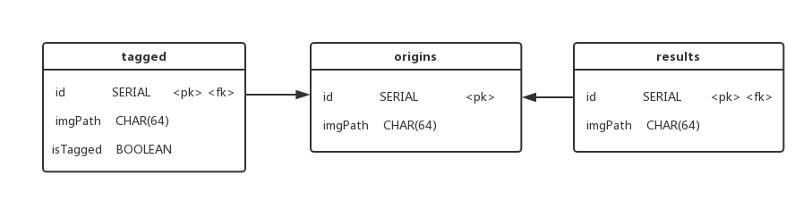

# Cloud-Robot-ROS

Training Project Cloud Robot Based on ROS

中山大学数据科学与计算机学院软件工程软件综合实训项目

面向机器人的软件设计与开发实训


## 1. 项目架构


## 2. 数据库设计

数据库设计了三个表，**origins** 存储上传的原图片存放的路径；**tagged** 存放对应上传图片的手动标记图片存放的路径，**isTagged** 代表是否已经被手动标记过；**results** 存储上传图片识别结果图片存放的路径；其中 **tagged** 和 **results** 的属性 **id** 都是以 **origins** 的属性 **id** 为外键。

**tagged** 的图片可以通过标记工具手动标记图片中的物体然后训练模型提高识别率，或针对某一特定物体去标记然后训练识别特定物体的模型。




## 3. 开发配置

开发环境：Ubuntu 16.04

开发平台：ROS Kinetic Kame

Python: python3.5

C++: C++11

### 3.1 Ubuntu16.04 安装 python3.5

在终端下输入以下命令：

```shell
# 安装python3.5
$ sudo apt-get install python3

# 安装pip
$ sudo apt install python-pip
```

### 3.2 配置virtualenv

在终端下输入以下命令：

```shell
# 安装virtualenv
$ sudo pip install virtualenv

# 创建rosenv
$ virtualenv rosenv -p /usr/bin/python3.5

# 在创建rosenv路径下执行以下命令使用虚拟环境
$ source rosenv/bin/activate

# 在项目路径下执行下面命令安装依赖包
$ pip install -r requirements.txt
```

### 3.3 配置Tensorflow物体识别模块

```shell
# 在创建rosenv路径下执行以下命令使用虚拟环境
$ source rosenv/bin/activate

# for Ubuntu Python 3.5
$ pip3 install --upgrade https://storage.googleapis.com/tensorflow/linux/cpu/tensorflow-1.6.0-cp35-cp35m-linux_x86_64.whl

# 验证Tensorflow安装成功
$ python
# Python
import tensorflow as tf
hello = tf.constant('Hello, TensorFlow!')
sess = tf.Session()
print(sess.run(hello))
# 如果系统输出以下内容，就说明安装成功：
Hello, TensorFlow!

# 下载tensorflow/models
$ git clone https://github.com/tensorflow/models.git

# 安装需要的包
$ sudo apt-get install protobuf-compiler python-pil python-lxml python-tk

# 安装COCO API
$ git clone https://github.com/cocodataset/cocoapi.git
$ cd cocoapi/PythonAPI
$ make
$ cp -r pycocotools <path_to_tensorflow>/models/research/

# 在/models/research/目录下编译Protobuf
$ protoc object_detection/protos/*.proto --python_out=.

# 在/models/research/目录下通过pwd获取完整路径
$ pwd
# 将pwd输出的路径在添加到~/.bashrc中
export PYTHONPATH=$PYTHONPATH:`pwd`:`pwd`/slim
# 使修改后的配置生效
$ source ~/.bashrc

# 验证安装models安装成功
$ python object_detection/builders/model_builder_test.py
```


## 4. 文件结构

```
|-ROS_Object_Detection/
    |-srv/                          # 存放定义的服务
        |-Img.src                   # 定义传输图片服务
    |-scripts/                      # 脚本文件夹
        |-datbase/                  # 数据库文件夹
            |-origins/              # 存放原图片文件夹
            |-tagged/               # 存放待标记和已标记图片文件夹
            |-results/              # 存放识别后的结果图片文件夹
            |-database.py           # 配置数据库
        |-object_detection/         # 物体识别模块
        |-static/                   # 静态文件
            |-css/                  # css样式文件
                |-style.css
            |-js/                   # js文件
                |-jquery.js
                |-load.js
                |-upload.js
            |-images/               # 项目相关图片、图标
   	    |-templates/                # html模版
   	        |-base.html
   	        |-index.html
   	        |-result.html
        |-cloud_server.py           # 服务器节点
        |-db_manage.py              # 管理数据库脚本
        |-robot_client.py           # 客户端节点
        |-obj_detect.py             # 物体检测识别
        |-web_server.py             # web端
    |-CMakeLists.txt                # 程序包元信息
    |-package.xml                   # 软件包清单
    |-README.md                     # README
    |-requirements.txt              # python依赖包文件
```


## 5. 运行项目

```shell
# 每次运行时需要先进入虚拟环境rosenv
# 通过在创建rosenv虚拟环境的路径下执行命令启动rosenv虚拟环境
$ source rosenv/bin/activate

# 进入工作空间下的src文件夹
$ cd ~/catkin_ws/src
$ git clone https://github.com/Songkc/ROS_Object_Detection.git

# 回到工作空间进行编译程序包并运行setup.bash脚本
$ cd ~/catkin_ws
$ catkin_make
$ . ~/catkin_ws/devel/setup.bash

# 进入项目脚本文件夹
$ roscd rosproject/scripts

# 后台运行roscore
$ nohup roscore &

# 运行web服务器
$ rosrun rosproject web_server.py

---

# 打开另一个终端，同样先进入虚拟环境
$ source rosenv/bin/activate

# 运行setup.bash脚本
$ . ~/catkin_ws/devel/setup.bash

# 接着进入到项目脚本文件夹目录下运行Server节点
$ roscd rosproject/scripts
$ rosrun rosproject cloud_server.py
```


## 6. 项目进度

已完成：

* web端（PC端可上传文件，移动端可上传本地文件或拍摄照片上传）
* 机器人节点（对较大的图片进行压缩）
* 服务器节点（进行物体识别）
* 物体检测模块
* 数据库

未完成：

* 训练模块


## 团队协作

Tower: <https://tower.im/projects/b6a5296a02404e99a69ec330ca8bcb3f/>