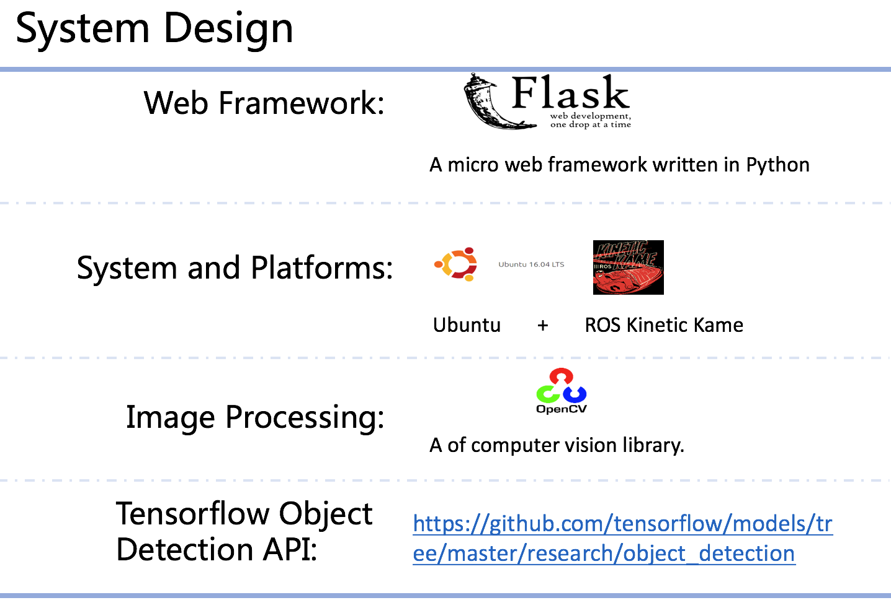
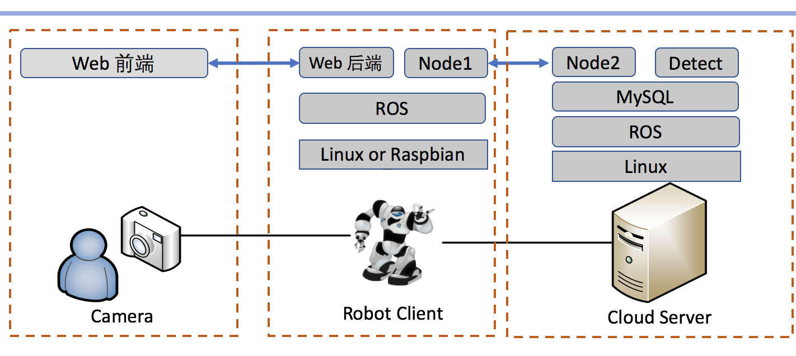
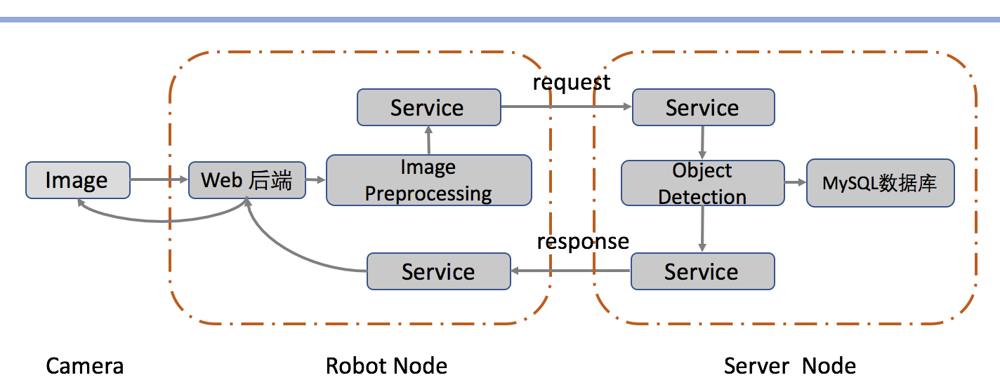

# Cloud-Robot-ROS

Training Project Cloud Robot Based on ROS

中山大学数据科学与计算机学院软件工程软件综合实训项目

面向机器人的软件软件设计与开发实训


## 1. 开发配置

开发环境：Ubuntu 16.04

开发平台：ROS Kinetic Kame

Python: python3.5

C++: C++11

### 1.1 Ubuntu16.04 安装 python3.5

在终端下输入以下命令：

```shell
# 安装python3.5
$ sudo apt-get install python3

# 安装pip
$ sudo apt install python-pip
```

### 1.2 配置virtualenv

在终端下输入以下命令：

```shell
# 安装virtualenv
$ sudo pip install virtualenv

# 创建rosenv
$ virtualenv rosenv -p /usr/bin/python3.5

# 在创建rosenv路径下执行以下命令使用虚拟环境
$ source rosenv/bin/activate

# 在项目路径下执行下面命令安装依赖包
$ pip install -r requirements.txt
```


## 2. 文件结构

```
|-rosproject/
    |-srv
    |-images/                       # 项目相关图片
    |-scripts/                      # 脚本文件夹
        |-input/                    # 存放上传的图片的文件夹
        |-output/                   # 存放识别后的图片的文件夹
    	|-static/                   # 静态文件
    		|-css/                  # css样式文件
    			|-style.css
    		|-images/               # 图片、图标
    			|-favicon.ico
    		|-js/                   # js文件
    			|-jquery.js
    			|-webcam.js
   		|-templates/                # html模版
   			|-index.html
        |-cloud_server.py           # 服务器节点
        |-robot_client.py           # 客户端节点
        |-object_detection.py       # 物体检测识别
        |-web_server.py             # web端
    |-CMakeLists.txt                # 程序包元信息
    |-package.xml
    |-README.md                     # README
    |-requirements.txt              # python依赖包文件
```


## 3. 项目架构










## 4. 项目进度

已完成：

* 物体检测模块

待完善：

* web端（增加本地选择文件）

* 服务器节点（结合物体检测模块）
* 机器人节点（增加图片预处理）

未完成：

* 数据库


## 5. 运行项目

```shell
# 每次运行时需要先进入虚拟环境rosenv
# 通过在创建rosenv虚拟环境的路径下执行命令启动rosenv虚拟环境
$ source rosenv/bin/activate

# 进入工作空间下的src文件夹
$ cd ~/catkin_ws/src
$ git clone https://github.com/Songkc/ROS_Object_Detection.git

# 回到工作空间进行编译程序包
$ cd ~/catkin_ws
$ catkin_make
$ . ~/catkin_ws/devel/setup.bash

# 进入项目脚本文件夹
$ roscd ROS_Object_Detection
$ cd scripts

# 后台运行roscore
$ nohup roscore &
# 运行web服务器
$ rosrun ROS_Object_Detection web_server.py

# 打开另一个终端，同样进入到ROS_Object_Detection目录下，运行Server节点
$ rosrun ROS_Object_Detection cloud_server.py
```


## 团队协作

Tower: <https://tower.im/projects/b6a5296a02404e99a69ec330ca8bcb3f/>