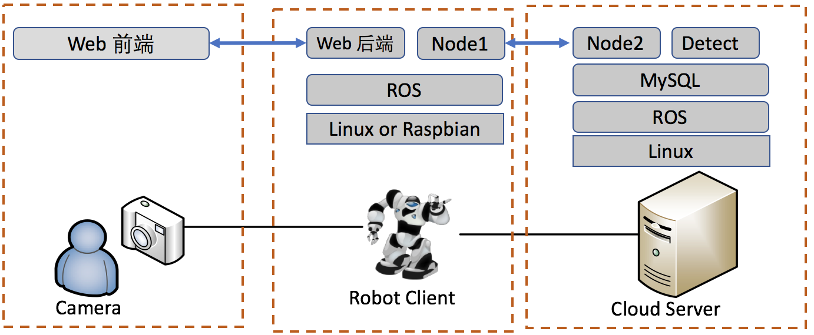
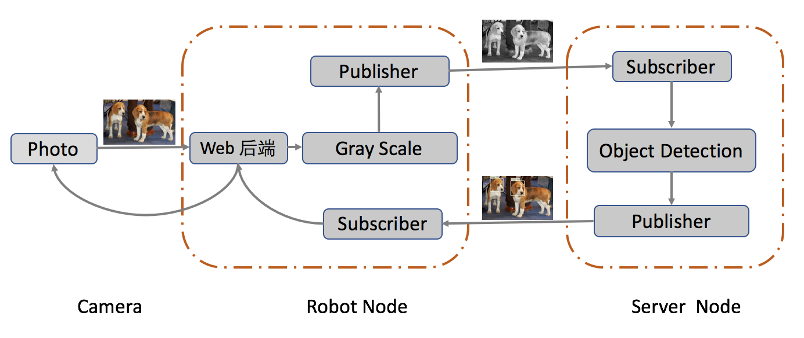

# Cloud-Robot-ROS

Training Project Cloud Robot Based on ROS

中山大学数据科学与计算机学院软件工程软件综合实训项目

面向机器人的软件软件设计与开发实训


## 1. 开发配置

开发环境：Ubuntu 16.04

开发平台：ROS Kinetic Kame

Python: python3.5

C++: C++11

### 1.1 Ubuntu16.04 python2.7升级python3.5

在终端下输入以下命令：

```shell
# 安装python3.5
$ sudo apt-get install python3

# 备份python2.7的链接
$ sudo cp /usr/bin/python /usr/bin/python_bak

# 删除原来默认指向python2.7版本的链接
$ sudo rm /usr/bin/python

# 重新指定新的链接给python3.5版本
$ sudo ln -s /usr/bin/python3 /usr/bin/python
```

### 1.2 配置virtualenv

在终端下输入以下命令：

```shell
# 安装pip3
$ sudo apt-get install python3-pip

# 安装virtualenv
$ pip3 install virtualenv

# 进入工作空间workspace下
$ cd ~/catkin_ws/src

# 创建venv
$ virtualenv --no-site-packages venv

# 安装依赖包
$ pip3 install -r requirements.txt
```

开发时需要先在工作空间下输入命令`source venv/bin/activate`，退出时输入命令`deactivate`


## 2. 文件结构

```
|-rosproject/
    |-msg/
    |-scripts/                      # 脚本文件夹
        |-cloud_server.py           # 云服务计算
        |-object_detection.py       # 物体检测识别
        |-web_server.py             # web后端
    |-CMakeLists.txt                # 程序包元信息
    |-package.xml
    |-README.md                     # README
    |-requirements.txt              # python依赖包文件
```


## 3. 项目架构







## 4. 项目进度

已完成：

* 物体检测模块

未完成：

* web服务端
* 云端
* 数据库


## 团队协作

Tower: <https://tower.im/projects/b6a5296a02404e99a69ec330ca8bcb3f/>